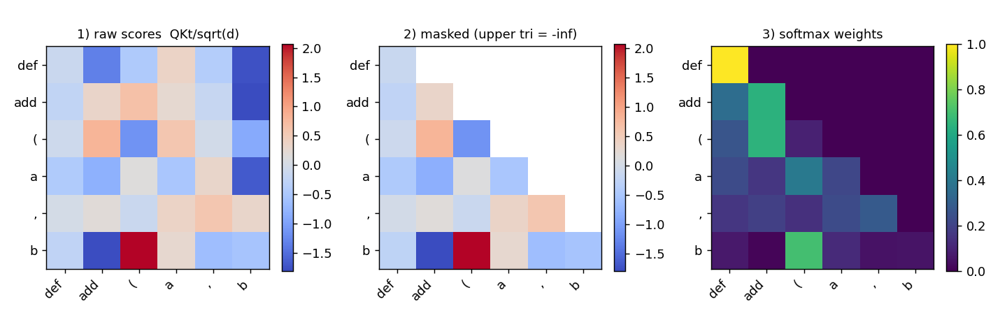
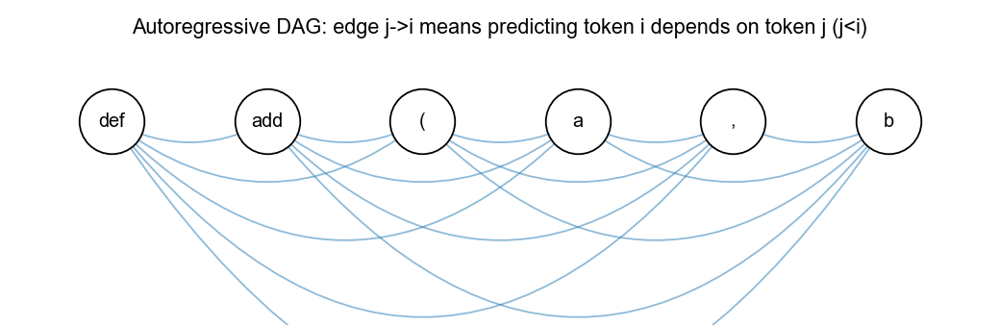

# Mask、三角矩阵与因果掩码：历史、起源与原理

> 本文以 CodeChat 仓库中的实际代码（`codechat/gpt.py`、`codechat/dataloader.py`）为主线，
> 辅以 HuggingFace `transformers` 库的对应实现，讲清楚三个纠缠在一起、却经常被混为一谈的概念：
> **mask（掩码）**、**三角矩阵（triangular matrix）**、**causal mask（因果掩码）**。
>
> 一句话先摆在这里：在本仓库里，因果掩码被 PyTorch 的一行 `is_causal=True` 隐藏掉了
> （`codechat/gpt.py:67`），三角矩阵被藏进了内核里；而另一种完全不同的 mask——**loss mask**
> （`ignore_index=-100`，`codechat/gpt.py:132`、`codechat/dataloader.py`）——却显式地散落在数据管线各处。
> 把这两种 mask 分清楚，是读懂整个训练流程的前提。
>
> **📖 怎么读这篇文章**：如果你是小白、被公式劝退过，**请从下面的《🎯 写在前面》读起**——
> 那一节不用任何数学，只讲三个生活场景，看懂它你就抓住了全文八成。带着那些比喻再往下看编号章节，会轻松很多。

---

## 🎯 写在前面：不懂代码也能看完的三个生活场景

> "教育不是灌输，而是点燃火焰。" —— 苏格拉底

如果你被 `QKᵀ`、`softmax`、`-∞` 这些符号吓退了——别急。这一节**不用任何数学**，
只用几个生活场景，把"掩码 / 因果掩码 / 三角矩阵 / 损失掩码"讲成人话。

### 故事的起点：1953 年，一个想改进考卷的人

1953 年，一位叫 **Wilson Taylor** 的学者想解决一个很实在的问题：**怎么衡量一篇文章好不好读？**
他想了个绝招——把文章每隔几个词挖掉一个，做成填空题让人来填：

> "小明早上起床后，先 ____ 了牙，然后吃了 ____。"

读者要是能轻松填出"刷""早饭"，说明文章通顺好懂；要是填得磕磕绊绊，说明文章别扭。
他给这种"挖空填词"的测试起了个名字：**完形填空（cloze test）**。

这个七十年前为了改考卷发明的小把戏，就是**今天所有大语言模型（包括 ChatGPT、包括本项目 CodeChat）训练方法的祖师爷**。
因为人们后来发现了一件惊人的事：

> **一台机器，如果能把海量文章里被挖掉的词都填对，它就"顺便"学会了语法、常识、推理、甚至写代码。**

"填空填得好 = 真的读懂了"——这就是训练大模型的全部秘密。剩下所有技术细节，都在回答一个问题：**"空"该怎么挖、怎么保证它老老实实地猜？** 而"掩码"，就是挖空和防作弊用的那块**遮挡板**。

> 一句话：**训练大模型 = 拼命做完形填空；掩码 = 挖空和防作弊用的遮挡板。**

### 场景一：什么是"掩码"？—— 就是"拿张纸遮住一部分"

"掩码（mask）"听着高级，其实你天天在用：

- 做数学题时，你用手**遮住**下面的答案，逼自己先想一遍。
- 老师改卷时，只看你**手写的答案**，不管卷子上**印好的题目**。
- 手电筒在黑夜里只**照亮**一小片，其余全黑。

掩码就是这么一张"遮挡板"：**把一部分盖住，让你只关注该关注的。** 在大模型里，这块遮挡板出现在两个完全不同的地方——一个管"**别偷看**"，一个管"**别乱改**"。下面两个场景分别讲。

> 一句话：**掩码 = 一张遮挡板，意思是"这部分你别看 / 别管"。**

### 场景二：因果掩码 —— 玩词语接龙时，不许偷看后面

想象你在玩**词语接龙**，或者就是在写一句话。当你写"我 爱 吃 ___"的时候，
你**只能看到已经写出来的"我爱吃"，看不到还没写的字**——因为它压根还不存在。这天经地义。

问题出在训练机器的时候。为了**快**，我们会把整句话"我爱吃苹果"一次性喂给模型。
可这就**作弊**了：模型要预测第 4 个字时，眼睛一瞟就看见了标准答案"苹果"，它根本不用动脑子。

**"因果掩码"就是那张防作弊的纸**：模型每预测一个字，就把这个字**右边（后面）的所有字全遮住**，
逼它只能根据**左边（前面）已经出现的字**去猜。就像开车只能看后视镜（过去），不能看到还没发生的路（未来）。

- 预测第 1 个字"我"：什么都没有，凭空猜。
- 预测第 2 个字"爱"：只准看"我"。
- 预测第 3 个字"吃"：只准看"我爱"。
- 预测第 4 个字"苹果"：只准看"我爱吃"。

**"能看的东西越往后越多，一个一个往上加"**——记住这个"越加越多"，下一节的三角形就是它。

> 一句话：**因果掩码 = 预测每个字时，把它后面的字全遮住，逼模型"只看过去、不偷看未来"。**
> （之所以叫"因果"，是因为它模仿了时间的规律：只有过去能影响现在，未来还没发生。）

### 场景三：三角矩阵 —— 一张"谁能看谁"的座位表，形状像楼梯

把上面那句"我爱吃苹果"排成一行，做一张表格：**行 = 正在预测的字，列 = 它能不能看见的字**，
能看打 `1`，不能看打 `0`：

```
          我   爱   吃  苹果
    我      1    0    0    0      ← 预测"我"，只能看自己
    爱      1    1    0    0      ← 预测"爱"，能看 我、爱
    吃      1    1    1    0      ← 能看 我、爱、吃
   苹果     1    1    1    1      ← 能看全部
```

看见那些 `1` 组成的形状了吗？——**是一个楼梯，也就是一个三角形。** 这就是"**三角矩阵**"这个名字的来历：
它不是什么高深的东西，就是"因果掩码"这张座位表**天生长成的楼梯形状**。数学家几百年前研究解方程时
就反复见到这种"下三角"形状（比如中国《九章算术》的消元法、高斯消元法），大模型只是把这个老朋友借来用了。

> 一句话：**三角矩阵 = 那张"谁能看谁"座位表的形状；因为"能看的越来越多"，`1` 自然堆成一个楼梯（三角形）。**

### 场景四：损失掩码 —— 老师只批改你"写的部分"，不批改印好的题目

前面三个场景讲的是**"别偷看"**。还有另一块完全不同的遮挡板，管的是**"别乱改（别乱学）"**。

一段 AI 对话长这样：**系统设定** + **用户的提问** + **AI 的回答**。我们只想教会 AI **怎么回答**，
可**不想**让它去死记硬背用户的问题、或工具返回的一堆数据。

于是就像老师改卷——**只批改学生手写的答案，卷子上印好的题目不算分**。在代码里，
这块"不算分"的遮挡板用一个特殊数字 `-100` 表示：凡是标了 `-100` 的字，**既不打分、也不用来学**。
模型的注意力全部集中在"学会怎么当好那个回答问题的 AI"。

> 一句话：**损失掩码 = 改卷时只批改 AI 该学的"回答"，把用户提问、系统设定标成 `-100`（不计分）。**

### 把亲戚认全：word2vec、BERT、dropout 也都是"挖空—填空"

理解了"完形填空"这个祖师爷，很多听起来吓人的名词一下就亲切了——它们都是一家人，只是**挖空的方式不同**：

| 名字 | 通俗说法 | 怎么挖空 |
|---|---|---|
| **word2vec**（2013） | 给周围一圈词，猜中间挖掉的那个词 | 挖中间一个，左右都能看 |
| **BERT**（2018） | 一句话里随机挖掉几个词，让你补 | 随机挖几个，左右都能看 |
| **GPT / 本项目** | 词语接龙，只能看前面猜下一个 | "空"永远在最右边，只能看左边 |
| **dropout** | 训练时随机蒙住自己一些"脑细胞"，逼你别偏科 | 挖的不是词，是网络自己的神经元；而且不是为了填空，是为了练"抗干扰" |

前三个是**"挖空让你填"**（挖的是要预测的答案）；`dropout` 是个远房亲戚——它也"随机蒙住一部分"，
但目的不是让你填空，而是**逼模型别太依赖某几个神经元**，练出"缺胳膊少腿也能干活"的鲁棒性。
（有意思的是，**本项目其实没开 dropout**——现代大模型数据够多，不需要它，后面第 8 章会讲。）

> 一句话：**它们是一个家族——都在"藏一部分、猜一部分"。区别只在"藏什么、能不能看两边、藏了是要你填还是只为抗干扰"。**

### 一张图看全（看懂这张就够了）

```
                    完形填空（1953）：藏一部分，猜一部分
                                  │
        ┌─────────────────────────┼──────────────────────────┐
   藏"答案"让你填              藏"信息流"防偷看             藏"神经元"练抗干扰
   （挖空 = 出题）             （因果掩码 = 词语接龙）        （dropout = 别偏科）
        │                          │                          │
   word2vec / BERT            👉 本项目 CodeChat 用这个 👈      本项目没用（=0）
   （左右都能看）              （只看左边 + 楼梯形三角矩阵）    （靠海量数据代替）

   另外还有一块独立的遮挡板：损失掩码（改卷只批改 AI 的回答，其余标 -100）
```

> **读到这里，你已经掌握了这篇文章的灵魂：**
> 掩码就是遮挡板；因果掩码是"接龙时不许偷看后面"，遮出来的形状是楼梯（三角矩阵）；
> 损失掩码是"改卷只算 AI 写的部分"。**下面带编号的章节，是给想看代码、想搞懂数学细节的人准备的**——
> 你可以就此打住，也可以揣着上面这些比喻继续往下读，你会发现那些符号忽然都能对上号了。

---

## 0. 两种 mask，别搞混

"mask" 这个词在 Transformer 语境里至少指两件毫不相干的事，本仓库两者都用：

| | 因果掩码 (attention mask) | 损失掩码 (loss mask) |
|---|---|---|
| 作用对象 | 注意力分数矩阵 `QKᵀ`（`T×T`） | 交叉熵的 `targets`（`T`） |
| 目的 | 禁止 token 看见"未来" | 禁止某些 token 参与梯度 |
| 形状 | 二维三角矩阵 | 一维向量 |
| 本仓库位置 | `is_causal=True`（`gpt.py:67`） | `-100` / `ignore_index=-100`（`gpt.py:132`、`dataloader.py:81` 等） |
| 值语义 | `0`（可见）/ `-∞`（屏蔽） | 真实 token id（计损）/ `-100`（忽略） |

前者是**结构性**的、每个序列都一样、是"因果性"这条物理定律的体现；
后者是**内容性**的、每条样本不同、决定"这句话里哪几个字该被学"。
本文主体讲前者（因果掩码 + 三角矩阵），第 5 节回到后者，因为它才是本仓库里唯一"看得见"的 mask。

---

## 1. Mask 的起源：从信号处理到神经网络

"mask" 一词并非深度学习发明。它最早来自**摄影制版与信号处理**：一张遮片（mask）挡住一部分光/信号，只让你想要的部分通过。计算领域沿用了这个隐喻：

- **位掩码（bitmask）**：`x & 0b1010` 只保留特定的位，是计算机科学里 mask 最古老的用法，早于神经网络几十年。
- **图像处理的卷积掩码 / 核（kernel）**：一个小矩阵滑过图像，"遮住"邻域外的像素。
- **序列模型里的 padding mask**：把不等长序列补齐到同一长度后，用 mask 标记"这些位置是填充的、别算进去"。

到了神经网络时代，mask 演化出两条主线，正好对应第 0 节的两列：

1. **屏蔽计算**——在 attention 里，把某些位置的分数压到 `-∞`，softmax 之后权重变 0。这是**因果掩码**的技术手段。
2. **屏蔽损失**——在 loss 里，把某些位置标记为"不计梯度"。这是**loss mask**，PyTorch 用魔数 `-100` 实现。

因果掩码真正成名，是在 2017 年的论文 **《Attention Is All You Need》**（Vaswani et al.）。它把"未来不可见"这一自回归语言模型的根本约束，第一次干净地表达成了一个作用在注意力矩阵上的**下三角遮罩**。原文称之为 *"masked self-attention"*，并强调："我们通过在缩放点积注意力内部屏蔽（置为 −∞）所有对应非法连接的值来实现这一点。"

---

## 2. 三角矩阵：一个古老的线性代数工具被重新起用

**三角矩阵**（triangular matrix）远比深度学习古老，是 19 世纪线性代数的基本对象：

- **下三角矩阵（lower triangular）**：主对角线以上全为 0。
- **上三角矩阵（upper triangular）**：主对角线以下全为 0。

它们在数值计算里无处不在——**LU 分解**、**Cholesky 分解**、解线性方程组的前代/回代，都建立在三角矩阵"一个变量只依赖前面已解出的变量"这一性质上。注意这句话：**"只依赖前面的"**——这正是自回归语言模型需要的性质。因果掩码的天才之处，就是发现了"token t 只能依赖 token ≤ t"和"三角矩阵的解耦结构"是同一件事。

在 PyTorch 里，三角矩阵由两个函数直接生成，名字就来自 **tri**angular：

```python
import torch

T = 5
# torch.tril: 保留下三角（triangular-lower），其余置 0
mask = torch.tril(torch.ones(T, T))
# tensor([[1., 0., 0., 0., 0.],
#         [1., 1., 0., 0., 0.],
#         [1., 1., 1., 0., 0.],
#         [1., 1., 1., 1., 0.],
#         [1., 1., 1., 1., 1.]])
```

第 `i` 行的含义是：**query 位置 `i` 允许看哪些 key**。第 0 行只有 1 个 1（只能看自己），第 4 行全是 1（能看前面所有人）。这就是因果性："现在"能看"过去"，不能看"未来"。

---

## 3. 因果掩码：把三角矩阵接进注意力

标准缩放点积注意力（scaled dot-product attention）是：

```
Attention(Q, K, V) = softmax( QKᵀ / √d_k ) · V
```

`QKᵀ` 是一个 `T×T` 的分数矩阵，`scores[i][j]` = query `i` 对 key `j` 的相关度。如果什么都不做，位置 `i` 会看到全部 `j`（包括 `j > i` 的未来），训练时就"作弊"了——模型直接抄答案，学不到真正的语言建模能力。

**因果掩码 = 在 softmax 之前，把上三角（未来）位置加上 `-∞`**：

```python
import torch, math
import torch.nn.functional as F

def causal_attention(q, k, v):
    # q,k,v: (B, n_head, T, head_dim)
    T = q.size(-2)
    d_k = q.size(-1)
    scores = (q @ k.transpose(-2, -1)) / math.sqrt(d_k)   # (B, nh, T, T)

    # 上三角（不含对角线）设为 -inf —— 这就是因果掩码
    mask = torch.triu(torch.ones(T, T, device=q.device), diagonal=1).bool()
    scores = scores.masked_fill(mask, float("-inf"))

    attn = F.softmax(scores, dim=-1)   # -inf 经 softmax 后权重变 0
    return attn @ v
```

关键点：`softmax(-∞) = 0`。被屏蔽的未来位置在加权求和时权重恰好为 0，等价于"不存在"。用 `-∞` 而不是直接把权重设 0，是为了让 softmax 的归一化（分母）也自动排除这些位置，数学上更干净。

### 本仓库怎么做的：一行 `is_causal=True`

CodeChat 没有手写上面那段，而是把整块逻辑交给了 PyTorch 2.x 的融合内核 `scaled_dot_product_attention`（SDPA）。见 `codechat/gpt.py:59-69`：

```python
def forward(self, x):
    B, T, C = x.shape
    qkv = self.qkv(x)
    q, k, v = qkv.split(self.n_embd, dim=2)
    q = q.view(B, T, self.n_head, self.head_dim).transpose(1, 2)
    k = k.view(B, T, self.n_head, self.head_dim).transpose(1, 2)
    v = v.view(B, T, self.n_head, self.head_dim).transpose(1, 2)
    # Flash attention via SDPA
    y = F.scaled_dot_product_attention(q, k, v, is_causal=True)   # ← 因果掩码在这里
    y = y.transpose(1, 2).contiguous().view(B, T, C)
    return self.proj(y)
```

`is_causal=True` 这一个参数，替代了"生成三角矩阵 → `masked_fill(-inf)` → softmax"的全过程。这样做有两个实打实的好处，对本仓库的 8B / FSDP 训练至关重要：

1. **省显存**：不必真的物化一个 `T×T`（本仓库 `block_size=2048`，就是 `2048×2048`）的 mask 张量。FlashAttention 类内核在分块（tiling）时**隐式**跳过上三角块，`-∞` 从未在 HBM 里落地。
2. **省算力**：上三角的一半分数**根本不计算**。朴素实现会算满整个矩阵再屏蔽一半，是纯浪费；融合内核直接不算。

这也解释了为什么类名叫 `CausalSelfAttention`（`gpt.py:49`）却在代码里找不到任何 `tril`/`triu`——三角矩阵是概念上的，物理上被内核吸收了。

> 顺带一提，`generate()`（`gpt.py:136-148`）做自回归采样时，每步只取最后一个位置的 logits（`logits[:, -1, :]`）。这本身就是因果性的推理侧体现：预测第 `t+1` 个 token 只依赖前 `t` 个。因果掩码保证了"训练时并行地算 T 个位置"和"推理时逐个生成"这两种模式，学到的是同一个条件分布 `P(x_t | x_<t)`。

---

## 4. 对照：`transformers` 库里的因果掩码

HuggingFace `transformers` 支持从 GPT-2 到 Llama 的一大批模型，还要兼容 padding、左填充、KV-cache、SDPA / eager / FlashAttention 多后端，所以它的因果掩码**不能**只靠 `is_causal=True`——它必须把因果性和 padding mask 合并成一个显式张量。

**经典 GPT-2（`modeling_gpt2.py`）** 的做法最能看清三角矩阵的本质。它在建模时预先注册一个下三角 buffer：

```python
# transformers/models/gpt2/modeling_gpt2.py（精简示意）
self.register_buffer(
    "bias",
    torch.tril(torch.ones((max_positions, max_positions), dtype=torch.bool))
        .view(1, 1, max_positions, max_positions),
)

def _attn(self, query, key, value, attention_mask=None):
    attn_weights = torch.matmul(query, key.transpose(-1, -2))
    attn_weights = attn_weights / (value.size(-1) ** 0.5)

    query_length, key_length = query.size(-2), key.size(-2)
    causal_mask = self.bias[:, :, key_length - query_length : key_length, :key_length]
    mask_value = torch.finfo(attn_weights.dtype).min      # 该 dtype 能表示的最小值，充当 -inf
    attn_weights = torch.where(causal_mask, attn_weights, mask_value)

    if attention_mask is not None:      # 这是 padding mask，与因果 mask 相加
        attn_weights = attn_weights + attention_mask

    attn_weights = F.softmax(attn_weights, dim=-1)
    return torch.matmul(attn_weights, value)
```

对照本仓库，可以看到三点差异：

- **`torch.tril(...)` 是显式的**：GPT-2 把三角矩阵真真切切地物化成一个 buffer，本仓库靠 `is_causal=True` 把它藏进内核。
- **用 `torch.finfo(dtype).min` 而非 `-inf`**：数值稳定，避免 `-inf` 在混合精度下产生 `NaN`。
- **两种 mask 相加**：`causal_mask`（结构）与 `attention_mask`（哪些是 padding，内容）通过加法叠加，一次 softmax 同时满足两个约束。

**现代 Llama 系** 则把这套逻辑抽象成了 `_prepare_4d_causal_attention_mask`（及其新版 `create_causal_mask` / `AttentionMaskConverter`）：它根据 `is_causal`、`sliding_window`、`padding_mask` 动态合成一个 `(B, 1, T, T)` 的 4D float mask，再喂给统一的 attention 接口；当后端是 SDPA 且没有 padding 时，它会**退化成直接传 `is_causal=True`**——绕一圈又回到了本仓库那一行。

结论：**因果掩码的语义在所有实现里完全一致（下三角可见、上三角屏蔽），差异只在"物化 vs. 内核隐式"和"是否要和 padding mask 合并"。** 本仓库因为预训练/SFT 用等长打包（packing），几乎不需要 padding mask，所以能享受最简洁的 `is_causal=True`。

---

## 5. 另一种 mask：本仓库真正显式写出来的 loss mask

回到第 0 节的表格右列。因果掩码在本仓库是隐式的，但**损失掩码是显式且无处不在的**，它用的是 PyTorch 交叉熵的魔数 `-100`。

在模型前向里（`codechat/gpt.py:129-133`）：

```python
loss = F.cross_entropy(
    logits.view(-1, logits.size(-1)).float(),
    targets.view(-1),
    ignore_index=-100,          # ← 目标为 -100 的位置不产生任何梯度
)
```

`ignore_index=-100` 是 `nn.CrossEntropyLoss` 的默认值，历史上选 `-100` 是因为它绝不可能与任何合法的类别索引（0..vocab_size-1）冲突，是个安全的"哨兵值"。语义是：**凡是 target == -100 的位置，既不计入 loss，也不回传梯度。**

这在 SFT（监督微调）里是核心机制。看 `codechat/dataloader.py` 的 funcall SFT 分词逻辑（`:208-234`）：

```python
labels: list[int] = []
...
labels.extend([-100] * len(prefix_ids))    # system/user/角色标签 → 不学
...
labels.extend(body_ids + suffix_ids)       # assistant 正文 → 要学
...
labels.extend([-100] * len(span))          # function_response → 不学
# 结尾：若最后一句是 assistant，保留 EOT 让模型学会"停"，否则也 mask
labels.append(EOT if last_role == "assistant" else -100)
```

以及定长打包 / padding 时的补齐（`dataloader.py:79-81`、`:243-244`）：

```python
if len(labels) < self.block_size + 1:
    pad = self.block_size + 1 - len(labels)
    labels = labels + [-100] * pad          # padding 位置 → 不学
```

**为什么要 loss mask？** 一段对话里包含系统提示、用户提问、工具返回、助手回答。我们只想让模型学会"在正确时机生成助手回答（以及何时发起 `<functioncall>`）"，而**不该**去背诵用户的问题或工具的返回值。于是把非助手片段的 label 全设成 `-100`，梯度只从助手 token 流出。这正是 `CLAUDE.md` 里写的那条约定：

> **Loss masking** in funcall SFT: only assistant-segment tokens get gradients; system / user / function_response tokens are `-100`.

**它和因果掩码正交，缺一不可**：因果掩码保证"预测第 t 个 token 时只用前 t-1 个"（结构约束，每条样本都一样）；loss mask 保证"只有助手片段的预测被计入损失"（内容约束，每条样本不同）。一个管**能看见什么**，一个管**要学什么**。

---

## 6. 跑起来看：一个可视化 demo

前面全是文字，容易停留在抽象。仓库里放了一个**能直接跑、会出图**的最小例子：
`docs/examples/causal_mask_demo.py`（只依赖 `torch` + `matplotlib`，无头环境也能跑，
同时在终端打印 ASCII 版）。

```bash
python docs/examples/causal_mask_demo.py
# -> docs/images/causal_mask.png / attention_masked.png / causal_dag.png
```

它用一小段"代码 token" `["def","add","(","a",",","b"]` 演示三件事。

### 6.1 掩码本身就是一个下三角

终端会打印出这张表（行=query，列=key，1=能看见）：

```
        def  add    (    a    ,    b
  def   1    0    0    0    0    0
  add   1    1    0    0    0    0
    (   1    1    1    0    0    0
    a   1    1    1    1    0    0
    ,   1    1    1    1    1    0
    b   1    1    1    1    1    1
```

一眼看出：第 0 行（`def`）只能看自己，最后一行（`b`）能看全部——这就是"现在能看过去、不能看未来"。

### 6.2 掩码如何改变注意力：−∞ → softmax → 0



三连图从左到右：**①原始分数** `QKᵀ/√d`（满矩阵，上三角也有值）→ **②加掩码**（上三角被置 −∞，图中留白）
→ **③softmax 权重**（上三角恰好变 0，每行归一化后和为 1）。终端同步打印数值，可见未来位置权重全是 `0.00`：

```
       def   add     (     a     ,     b
  add 0.36  0.64  0.00  0.00  0.00  0.00
    ( 0.26  0.65  0.09  0.00  0.00  0.00
```

这就是第 3 节 `softmax(-∞)=0` 那句话的实物。

### 6.3 掩码 ⇔ 一张有向图（DAG）



同一件事换个视角：每个 token 的预测**依赖它左边所有 token**，画成有向图就是上面这张——
箭头 `j→i`（`j<i`）密密麻麻地指向右边。这张图的邻接矩阵，正是 6.1 那个下三角。
把它写成概率就是**自回归分解**：

```
P(seq) = P(def|∅)·P(add|def)·P( ( |def,add)·P(a|def,add,()·P( , |…)·P(b|…)
```

**下三角掩码、注意力权重、这张 DAG、这个连乘式——是同一个东西的四种画法。** 这正好把我们引向下一个问题:
这张 DAG 里的"箭头"和因果推断里的"因果箭头",是一回事吗?

---

## 7. 因果推理 ≠ 因果掩码：同名，不同物

用户会很自然地问:贝叶斯网络、有向无环图(DAG)、do-算子那一套"因果推断",
和 Transformer 的"因果掩码"是什么关系?毕竟都叫 **causal**,都画成有向图。

**结论先行:它们共享"有向图 + 拓扑序"这套数学外壳,但"因果"二字的含义完全不同。
Transformer 的 causal mask 里的 "causal" 指的是"时间先后"(temporal / autoregressive),
不是 Judea Pearl 意义上的"因果机制"(mechanism / intervention)。更准确的名字其实是"自回归掩码"。**

### 7.1 两种"因果图"的对照

| | 因果推断的 DAG(Pearl / 贝叶斯网络) | Transformer 的"因果"掩码 |
|---|---|---|
| 节点 | 随机变量(吸烟、焦油、癌症) | 序列位置上的 token |
| 边 `X→Y` | **因果机制**:干预 X 会改变 Y | **时间在先**:位置 j 在 i 左边 |
| 图结构 | 由领域知识/因果发现得到,**稀疏、任意** | **固定的全连下三角**,与内容无关 |
| 核心问题 | `P(Y \| do(X))`——**干预**后会怎样 | `P(x_t \| x_<t)`——**观测**到前文后下一个是什么 |
| 支持反事实 | 是(倒数第三层:若当初不吸烟?) | 否(只建模观测分布) |
| 边的方向可翻转吗 | 不能,翻转就改变因果论断 | 可选(BERT 就用双向,去掉下三角) |

一句话:**因果推断问的是"改变原因,结果会不会变";因果掩码只是保证"算第 t 个词时别偷看后面的词"。**
后者是一条工程约束(防止训练作弊 + 让训练/推理一致),不是关于世界的因果论断。

### 7.2 但它们确实在一个点上接壤:概率的链式法则

联系不是巧合。任何联合分布都能按**任意**变量顺序做链式分解:

```
P(x1,…,xT) = ∏_t P(x_t | x_1,…,x_{t-1})
```

这本身就是一个贝叶斯网络——一个**全连接的下三角 DAG**(第 6.3 节那张图)。
自回归语言模型选定了"从左到右"这一个顺序,并用因果掩码把这个 DAG 的结构**焊死在注意力计算里**:
位置 `i` 的注意力只允许连到 `j≤i`,等价于"节点 i 的父节点 = 它前面所有节点"。

所以这层关系是:**因果掩码 = 一个特定(全连、下三角、按 token 顺序)贝叶斯网络的邻接结构在计算图里的实现。**
它借用了贝叶斯网络的**数学形式**(有向、无环、拓扑序 → 可分解、可并行),
但**没有借用**其**因果语义**(边不代表机制,模型学到的是相关性 `P(next|context)`,而非 `P(·|do(·))`)。

### 7.3 那本项目的大模型里,"因果"到底体现在哪?

回到 CodeChat 自己的代码,把上面的抽象落到实处:

- **结构层面**——因果掩码就是 `codechat/gpt.py:67` 的 `is_causal=True`。它在每一层、每个注意力头里,
  强制实现 7.2 里那个下三角 DAG。模型有 40 层(`8b` preset),但**每一层用的都是同一张下三角图**;
  深度带来的是表示能力,不是更复杂的依赖图——依赖图永远是那个固定的三角。

- **概率层面**——训练目标 `F.cross_entropy(logits, targets)`(`gpt.py:129`)最小化的就是
  `-∑ log P(x_t | x_<t)`,即 7.2 那个连乘式的负对数。模型学的是**观测条件分布**,
  是"给定前文,下一个 token 的经验频率",**不是**"干预某个 token 会如何改变后文"。
  这就是为什么 LLM 会有"相关≠因果"的经典毛病:它没被训练去回答 `do()` 问题。

- **"推理链"是什么?**——当模型做 chain-of-thought、一步步推导时,那条"推理链"看起来很像因果链,
  但它在机制上仍然是**自回归采样**:每一步 `generate()`(`gpt.py:136`)都只是从 `P(x_t|x_<t)` 采样。
  "链"之所以看着有因果性,是因为**训练数据里的人类推理本身有因果结构**,模型把这种结构当作
  统计规律学了进来——它是在**模仿**因果推理的文本表现,而不是在图上跑 do-算子。
  换句话说:**因果掩码提供的是"时间箭头",Pearl 意义上的"因果箭头"(如果有的话)是从数据里学来的软知识,
  不由掩码保证、也不受掩码约束。**

- **反过来印证**——funcall 场景(`codechat/funcall_reward.py`、`dataloader.py` 的 loss mask)也一样:
  模型学会"用户问天气 → 发 `<functioncall>`",这是数据里的**条件相关**被 SFT 固化,
  不是模型"理解"了调用天气 API 会导致得到天气。它不需要理解因果,只需要拟合 `P(下一段 | 前文)`。

### 7.4 一句话记住

> **贝叶斯网络的 DAG 用有向边编码"谁导致谁"(机制),回答干预与反事实;
> Transformer 的因果掩码用下三角编码"谁在谁之前"(时间),只回答"下一个词是什么"。
> 二者共享"有向无环 + 拓扑序 → 可分解"的数学骨架,这也是"因果掩码"这个名字的来处——
> 但它建模的是概率的链式法则,不是 Pearl 的因果阶梯。本项目的大模型自始至终工作在观测分布 `P(x_t|x_<t)` 上,
> "因果掩码"给的是时间序,不是因果性。**

---

## 8. 掩码的本质:word2vec、dropout、完形填空是同一种思想吗?

用户问得很到位:word2vec 的词袋模型(给一堆词猜中间填空)、dropout、以及"完形填空式"地训练"预测空缺"的能力——
这些和因果掩码是不是一回事?

**答案:在最高的哲学层面"是"——它们都属于"藏一部分、猜一部分"的自监督(self-supervision)家族;
但往下一层,掩码在其中扮演了三种本质不同的角色,不能一锅烩。** 先给结论表:

| 方法 | 藏什么 | 上下文方向 | mask 的角色 | 预测目标是被藏的东西吗? |
|---|---|---|---|---|
| **word2vec CBOW** | 中心词(1 个) | 双向(词袋,无序) | 定义任务:留出"空" | ✅ 是 |
| **BERT MLM** | 随机 15% token | 双向 | 定义任务:`[MASK]` 造"空" | ✅ 是 |
| **GPT / 本仓库** | 右边全部(未来) | 单向(只看左) | 约束信息流:防偷看 | ✅ 是(但"空"永远在最右端) |
| **Dropout** | 随机隐藏单元 | —— | 正则化:逼出冗余 | ❌ 否,被藏的不是预测目标 |

### 8.1 完形填空(cloze):这条思想的源头

"完形填空"不是深度学习发明的。1953 年心理语言学家 **Wilson Taylor** 提出 *cloze procedure*:
删掉文章里的词,让人根据上下文补全,以此测量文本可读性。核心假设是——
**"能填对空,说明你真的理解了上下文。"** 后来整个自监督预训练,本质上都是把这个测人的方法反过来拿去训机器:
**从无标注文本里,靠"挖空—补全"凭空造出监督信号。** 这就是"掩码本质"的那句话:

> **掩码 = 一台从数据结构里凭空生产监督信号的机器。** 你不需要人工标注,只要把数据的一部分藏起来,
> "该被藏的部分"自己就成了标签。藏法不同,就长出了 word2vec / BERT / GPT / dropout 这些不同的枝叶。

### 8.2 word2vec CBOW:一次浅层的、双向的完形填空

CBOW(Continuous Bag-of-Words)就是最朴素的神经完形填空:拿窗口内的上下文词,
**把它们的词向量加起来求平均(这就是"词袋"——丢掉词序)**,去预测正中间被挖掉的那个词。

```python
# CBOW 的精神(示意):给定上下文,预测中心词
context = ["the", "cat", "___", "on", "the", "mat"]   # 挖掉 "sat"
h = mean([embedding[w] for w in context if w != "___"])  # 词袋:求和平均,无序
logits = h @ W_out                                        # 预测填空
loss = cross_entropy(logits, target="sat")
```

它和本仓库的关系比看上去更近:**word2vec 训练完,真正留下来被使用的只有那张 `embedding` 表。**
而本仓库 `codechat/gpt.py:100` 的 `self.tok_emb = nn.Embedding(vocab_size, n_embd)` 正是这张表的直系后代——
只不过 CBOW 用"双向词袋 + 浅层线性"来训它,GPT 用"单向因果掩码 + 40 层 Transformer"来训它。
**词向量的血统是一样的,变的是产生监督信号的"挖空方式"和上面堆的算力。**

区别也在这里:CBOW 是**双向**的(能同时看左右),而且**无序**(词袋);
本仓库的因果掩码是**单向有序**的。所以严格说,GPT 不是"挖中间的空",而是"空永远在最右端"的退化完形填空——
BERT 的 MLM(随机挖中间的 token、双向补全)才是 CBOW 在深层网络里的正统续作。

### 8.3 Dropout:形似而神不同的"挖空"

Dropout(Hinton 2012 / Srivastava 2014)训练时随机把一部分**隐藏单元**置 0。
形式上它也是"随机挖空 + 用 mask 乘一下",所以直觉上很像完形填空。但它的**目的完全不同**:

- **CBOW / BERT / GPT 的掩码定义了"要预测什么"**——被藏的 token 就是标签,mask 制造任务。
- **Dropout 的掩码不制造任何预测目标**——被丢掉的单元不是要去预测的东西。它的目的是**正则化**:
  逼着网络不要依赖任何单一特征,从而学到冗余、鲁棒的表示。Hinton 的解释是**隐式集成**——
  每个 mini-batch 相当于训练一个不同的子网络,推理时再把它们"平均"起来。

真正把两者接上的桥,是**去噪自编码器(Denoising Autoencoder,Vincent 2008)**:
故意往输入里加噪声(比如随机置零一些输入),再让网络重建干净的原始输入。
- 从这个视角看,**BERT 的 MLM 就是一个"噪声=遮盖 token"的去噪自编码器**——挖空是加噪,补全是去噪。
- 而 **dropout 是加在隐藏层的噪声**,不要求重建、只要求"扛得住噪声还能干活"。

所以三者的关系可以这样收束:

```
                  "藏一部分,逼网络处理"
                          │
        ┌─────────────────┼─────────────────┐
   藏的是"标签"        藏的是"输入"         藏的是"隐藏单元"
   → 完形填空          → 去噪自编码          → dropout
   (CBOW/BERT/GPT)     (DAE, =MLM 的框架)   (正则化,无预测目标)
   目的:学预测        目的:学重建          目的:学鲁棒
```

### 8.4 那本仓库到底站在哪一支?

把上面的抽象落到 CodeChat 的代码上:

- **它是 GPT 那一支**:纯单向因果 LM,`is_causal=True`(`gpt.py:67`)。"空"永远在序列最右端,
  训练目标 `-∑ log P(x_t | x_<t)` 就是"永远在填最后一个空"。它**不做** BERT 式的中间挖空,
  也**不是**词袋——因果掩码恰恰是为了**保住词序**(词袋丢序,因果掩码严格定序)。

- **词向量是 word2vec 的后代**:`tok_emb`(`gpt.py:100`)与输出头权重共享(`gpt.py:106` 的 weight tying),
  这张 embedding 表就是 word2vec 那张表在大模型时代的样子——只是训练它的完形填空从"双向浅层"换成了"单向深层"。

- **dropout 在本仓库其实没启用**:`GPTConfig.dropout` 有这个字段(`gpt.py:24`,默认 `0.0`),
  但**代码里没有任何一处真正读取/施加它**(注意力、MLP、embedding 全无 dropout;SDPA 的 `dropout_p` 也用默认 0)。
  这是刻意的:这类大规模预训练靠**海量数据本身**做正则化,dropout 往往有害无益,现代 LLM(GPT-3 之后)大多关掉。
  —— 顺带一提,这个 `dropout` 字段属于**未接线的遗留配置**,按仓库规范我不擅自删除,仅在此指出。

### 8.5 一句话回答"是否是一致的思想"

> **是,也不是。** 说"是"——CBOW、BERT、GPT、dropout、去噪自编码,骨子里都是**"藏起一部分,逼网络去补"**
> 这一个自监督母题,cloze(完形填空)是它们共同的祖先。说"不是"——掩码在其中干三种不同的活:
> **① 造预测目标**(CBOW 挖中心词、BERT 挖随机 token、GPT 把空钉在最右端);
> **② 约束信息流**(因果掩码防止偷看未来,本仓库正是这一种);
> **③ 做正则化**(dropout 挖隐藏单元,不为预测、只为鲁棒)。
> **本仓库同时用了 ① 和 ②(空在右端 + 因果约束),继承了 word2vec 的词向量血统,却主动放弃了 ③(dropout=0)。**
> 把这三种活分清楚,"完形填空训练预测能力"这条直觉就能准确落到每一种掩码上,而不至于把它们混成一团。

---

## 9. 小结

| 概念 | 起源 | 数学形态 | 本仓库位置 |
|---|---|---|---|
| **mask（广义）** | 信号处理 / 位运算的"遮片"隐喻 | 逐元素 0/1 或 0/−∞ | 贯穿全仓 |
| **三角矩阵** | 19 世纪线性代数（LU/Cholesky/前代回代） | 下三角 `tril` / 上三角 `triu` | 概念上存在，被 SDPA 内核吸收 |
| **因果掩码** | 《Attention Is All You Need》(2017) 的 masked self-attention | 下三角可见、上三角置 −∞ | `is_causal=True`（`gpt.py:67`） |
| **loss mask** | PyTorch `CrossEntropyLoss` 的 `ignore_index=-100` | 一维哨兵向量 | `-100`（`gpt.py:132`、`dataloader.py`） |

三条线索最终汇成一句话：

> **自回归语言模型 = 用一个"下三角形状"的约束，把"未来不可见"这条因果律写进注意力（因果掩码 / 三角矩阵）；再用一个"哨兵向量"的约束，把"哪些 token 值得学"写进损失（loss mask）。**
> 前者在本仓库被 `is_causal=True` 一行浓缩，后者被 `-100` 显式铺陈——理解它们的分工，就理解了从 `codechat/gpt.py` 到 `codechat/dataloader.py` 整条训练管线的骨架。

### 参考

- Vaswani et al., *Attention Is All You Need*, NeurIPS 2017.
- Taylor, *"Cloze Procedure": A New Tool for Measuring Readability*, 1953（完形填空的源头）。
- Mikolov et al., *Efficient Estimation of Word Representations in Vector Space*, 2013（word2vec / CBOW / Skip-gram）。
- Vincent et al., *Extracting and Composing Robust Features with Denoising Autoencoders*, ICML 2008（去噪自编码）。
- Srivastava et al., *Dropout: A Simple Way to Prevent Neural Networks from Overfitting*, JMLR 2014。
- Devlin et al., *BERT: Pre-training of Deep Bidirectional Transformers*, 2018（MLM = 深层双向完形填空）。
- Pearl, *Causality: Models, Reasoning, and Inference*, 2009（因果推断 / do-算子 / 因果阶梯）。
- PyTorch 文档：`torch.nn.functional.scaled_dot_product_attention`、`torch.tril` / `torch.triu`、`torch.nn.CrossEntropyLoss`。
- HuggingFace `transformers`：`models/gpt2/modeling_gpt2.py`、`modeling_attn_mask_utils.py`（`AttentionMaskConverter` / `create_causal_mask`）。
- 本仓库：`codechat/gpt.py`、`codechat/dataloader.py`、`CLAUDE.md`（loss-masking 约定）。
