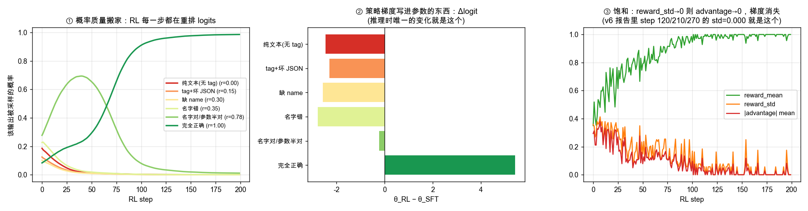
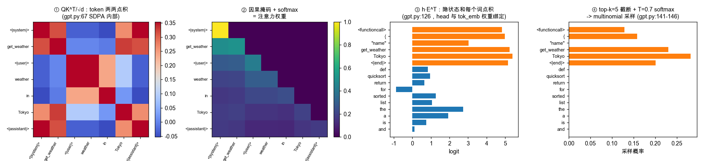
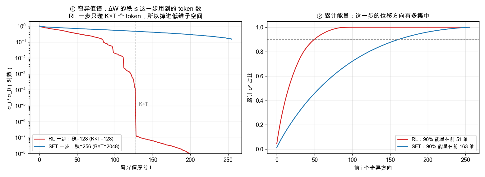

# 训练写权重，推理用权重 + 脚手架：SFT / RL 训完之后到底是怎么生效的

> 本文是 `CodeGPT/docs/SFT_RL_INFERENCE_MECHANICS.md` 的重写版，全部例子换成 **CodeChat 仓库里真实跑过的代码和真实训练数据**
> （`codechat/gpt.py`、`scripts/chat_sft.py`、`scripts/chat_rl_funcall.py`、`reports/TRAINING_REPORT_8b_*.md`）。
>
> 要回答的问题：
>
> 1. **为什么是"预训练 → SFT → RL"三步走**，而不是一次训完？每一步在 `W`（权重）里写入的东西不一样。
> 2. **推理时到底发生了什么**：纯靠 `W` 做一次 `forward` 够不够？不够的话还差什么？
> 3. **RL 训练的策略梯度参数，怎么体现在推理里？是如何生效的？**（第 9 节，本文重点）
> 4. **"语义拟合的参数子空间"是个什么过程？能不能把"从点积拟合到最终答出问题"整条链路画出来？**（第 10 节，本文重点，配 3 张可复现的图）
>
> 第 9、10 节配套的可执行 demo：`docs/examples/rl_inference_viz.py`（`python docs/examples/rl_inference_viz.py` 即可复现全部图和终端输出）。

---

## 目录

1. [核心二分：知识住在 W 里，协议住在代码里](#1-核心二分知识住在-w-里协议住在代码里)
2. [为什么是"预训练 → SFT → RL"三步，不是一步](#2-为什么是预训练--sft--rl三步不是一步)
3. [三步训练分别在 W 里写入了什么](#3-三步训练分别在-w-里写入了什么)
4. [推理时如果"什么都不做"会发生什么](#4-推理时如果什么都不做会发生什么)
5. [chat template：CodeChat 没有特殊 token，只有约定](#5-chat-templatecodechat-没有特殊-token只有约定)
6. [停止条件：本仓库有两套，且其中一套会误伤](#6-停止条件本仓库有两套且其中一套会误伤)
7. [采样参数：推理时对 W 的"温度旋钮"](#7-采样参数推理时对-w-的温度旋钮)
8. [W 装不下的东西：工具执行循环必须在代码里](#8-w-装不下的东西工具执行循环必须在代码里)
9. [**RL 的策略梯度参数怎么体现在推理中**](#9-rl-的策略梯度参数怎么体现在推理中)
10. [**语义拟合的参数子空间：从点积到答案的可视化**](#10-语义拟合的参数子空间从点积到答案的可视化)
11. [小结：一张"训练—推理"对齐表](#11-小结一张训练推理对齐表)

---

## 1. 核心二分：知识住在 W 里，协议住在代码里

答案不是"是"也不是"否"，而是：**大模型能力 = 权重 `W` + 脚手架代码，两者组成一个系统**。单独拿出 `W` 什么都跑不起来；单独拿出脚手架也没用。

先看 CodeChat 的 `forward`（`codechat/gpt.py:115-134`）：

```python
def forward(self, idx: torch.Tensor, targets: torch.Tensor | None = None):
    B, T = idx.shape
    assert T <= self.cfg.block_size, f"seq len {T} > block_size {self.cfg.block_size}"
    pos = torch.arange(T, device=idx.device)
    x = self.tok_emb(idx) + self.pos_emb(pos)[None, :, :]   # W 的一部分
    for block in self.blocks:                                # W 的主体
        x = block(x)
    x = self.ln_f(x)
    logits = self.head(x)                                    # W 的最后一层
```

这是一个纯函数：`(idx, W) → logits`。**`W` 是训练写进去的，`idx` 是推理时由外部代码构造好送进来的。**

```
┌──────────────────────────┬───────────────────────────────┐
│  训练阶段                 │  推理阶段                      │
│  ───────                  │  ───────                       │
│  读大量数据               │  接到用户的一条 prompt         │
│  forward + backward       │  拼成训练时的格式（chat 模板） │
│  梯度下降修改 W           │  encode → idx                  │
│  把"能力"压进 W           │  forward 得到 logits           │
│                           │  截断 + 采样出下一个 token     │
│                           │  循环，直到停止条件            │
│                           │  decode，必要时调用工具        │
└──────────────────────────┴───────────────────────────────┘
```

用户的问题——"用大模型时是纯靠参数预测吗？还是需要代码配合？"——问的是右半边。右半边几乎全是代码：
`scripts/chat_cli.py:28` 拼模板、`gpt.py:136-148` 跑采样循环、`scripts/funcall_cli.py:114` 判断停止、`funcall_cli.py:198-206` 执行工具。
**这些代码只要和训练时的约定不一致，`W` 里训好的能力就激活不了。**

> 一句话：知识（懂 Python、会输出 `<functioncall>`）住在 `W` 里；"怎么把问题喂给 `W`、怎么解读 `W` 的输出"这套协议住在推理代码里。协议不对，知识就调不出来。

---

## 2. 为什么是"预训练 → SFT → RL"三步，不是一步

### 2.1 数据量差了几个数量级

CodeChat 8B 这条线上的真实数字：

```
预训练:   data/pretrain/*.bin，github-code-clean Python 子集   30000 步 × 8 卡 × 2048 token
SFT:      data/sft_v6/train.jsonl（112k funcall + 20k code）    8000 步
RL:       data/rl_funcall/train.jsonl                            2267 条 → 283 步（1 epoch）
```

把 2267 条 RL 样本混进预训练语料里，信号会被稀释到看不见。分阶段训练的本质就是：**用不同的学习率、不同的数据配比、甚至不同的损失函数，在不同阶段强化不同的能力。**

看三个阶段的默认学习率就能看出这个"逐级收敛"的意图：

| 阶段 | 脚本 | 默认 LR | 备注 |
|---|---|---|---|
| 预训练 | `scripts/base_train.py:74` | `2e-4`（README 的 8B 示例传 `1.5e-4`） | 从随机初始化出发 |
| SFT | `scripts/chat_sft.py:67` | `5e-5`（v6 脚本传 `3e-5`） | 比预训练小一个量级 |
| RL | `scripts/chat_rl_funcall.py:246-248` | `1e-5` × `init_lr_frac=0.05` = **5e-7** | 再小两个量级，且线性衰减到 0 |

RL 的有效学习率是 SFT 的 1/100。这不是随手设的——它就是"RL 只做精修，不重教"的量化表达。

### 2.2 三步的分工

| 阶段 | 数据 | 损失函数 | 在 W 里写入什么 |
|---|---|---|---|
| 预训练 | GitHub Python 源码 | `F.cross_entropy(logits, next_token)` | 语法、库用法、基础推理 |
| SFT | 人写的问答对 / glaive 工具调用对话 | **同一个** `cross_entropy`，但 prompt 段 label 设为 `-100` | 对话格式、指令遵循、何时输出 `<functioncall>` |
| RL | 只有 prompt + 一个可判分的 ground truth | `-(advantage × logπ)` | 在已有分布里把概率质量搬到高分回答上 |

**关键观察**：SFT 在数学上就是预训练的子集。`codechat/gpt.py:129-133` 这一段被两个阶段共用：

```python
loss = F.cross_entropy(
    logits.view(-1, logits.size(-1)).float(),
    targets.view(-1),
    ignore_index=-100,        # ← SFT 唯一的变化：把不该学的位置标成 -100
)
```

SFT 的唯一变化在**数据**里，不在代码里。看 `scripts/prepare_sft_funcall.py:99-111`：

```python
if role == "assistant":
    # Prefix stays masked — model should not be rewarded for emitting
    # its own role tag; generation harness prepends it at inference.
    input_ids.extend(prefix_ids)
    labels.extend([-100] * len(prefix_ids))
    input_ids.extend(body_ids + suffix_ids)
    labels.extend(body_ids + suffix_ids)     # ← 只有这里有梯度
else:
    span = prefix_ids + body_ids + suffix_ids
    input_ids.extend(span)
    labels.extend([-100] * len(span))        # system / user / function_response 全遮住
```

注意那句注释：assistant 的角色标签**故意不监督**，因为推理时是 `chat_cli.py:28` / `funcall_cli.py:91` 这段代码替模型把 `<|assistant|>\n` 拼上去的。**训练时谁负责写这个标签，推理时就必须由谁写。** 这是本文第 5 节的伏笔。

RL 才是真正换了损失函数，需要一个新的训练循环（`scripts/chat_rl_funcall.py`）。

### 2.3 为什么必须先 SFT 再 RL —— 本仓库有反面教材

这不是理论，是 CodeChat 踩过的坑。`reports/TRAINING_REPORT_8b_a88_x8.md` 记录的 v1 pipeline：直接在代码能力很弱的 8B 上跑 MBPP 执行奖励的 GRPO，**415 步 reward 恒等于 0**。原因：

```
pass@k ≈ 0  →  一组 rollout 全部得 0 分
            →  advantage = r - r.mean() ≡ 0
            →  pg_loss 的梯度 ≡ 0
            →  跑了 415 步，W 没有任何变化
```

`scripts/eval_mbpp_pass_at_k.py` 后来就是为了在开跑前测出这件事而写的，它打印的 `VERDICT:` 行直接给结论：`pass@1 < 1%` → 别跑 RL。

所以顺序是：**SFT 负责粗定位**（把输出分布拉到"格式大致对"的流形上，让 reward 有非零方差），**RL 负责精修**（在这个流形里找高分方向）。跳过 SFT 直接 RL，reward 全 0，梯度全 0，什么都学不到。

---

## 3. 三步训练分别在 W 里写入了什么

### 3.1 预训练：所有参数，改动量最大

从 `gpt.py:109-113` 的 `N(0, 0.02²)` 随机初始化出发，8B preset（`depth=40, n_embd=4096`）的每一个矩阵都从噪声走到有语义。

### 3.2 SFT：所有参数，改动量小得多

v6 的 joint SFT 跑了 8000 步、lr `3e-5`，loss 从 2.51 降到 0.2–0.9（`reports/TRAINING_REPORT_8b_v6_unified.md`）。改的是同一套 `W`，但幅度小一个量级。效果是**分布层面的显著改变**：SFT 之后，模型看到 `<|user|>\n...\n<|end|>\n<|assistant|>\n` 就知道该开始答题，而不是接着写下一段 GitHub 代码。

### 3.3 RL：所有参数，但有效步长再小两个量级

CodeChat 的 RL 里**没有 KL 项、没有 ref model**——`chat_rl_funcall.py` 文件头的设计说明第 4 条写得很明白：

> **No KL, no ref model**: the dense reward + staircase is self-regularising enough. Dropping the ref model halves activation memory and cuts one forward pass per step.

也就是说，别家用 `L = -reward + β·KL(π_RL ‖ π_SFT)` 来约束"别跑太远"，CodeChat 换成了三个更省的约束：**极小的学习率（5e-7）、线性衰减到 0、只跑 1 个 epoch**。工程上等价，代价是失去了硬性的信任域保证。

### 3.4 所以"纯靠参数"这句话对一半

对的一半：

> 推理时每一个 token 的预测，真的就只是 `x @ W` 系列矩阵运算。模型不会去查"SFT 训练时见过的那条记录"。

不对的一半：

> "正确收到用户的问题"、"在合适的时候停下"、"把 token 解码成字符串"、"真的去调用天气 API"——这些一行都不在 `W` 里。

---

## 4. 推理时如果"什么都不做"会发生什么

假设你拿到 `checkpoints/codechat_8b_sft_v6/latest.pt`，然后只写：

```python
ids = torch.tensor([encode("写一个快排")])
out = model.generate(ids, max_new_tokens=512)
```

**大概率失败**，因为 SFT 时模型看到的从来不是裸 prompt，而是（`prepare_sft_funcall.py:95-97` 拼出来的）：

```
<|user|>
写一个快排
<|end|>
<|assistant|>
```

少了这层包装，`W` 里"看到 `<|assistant|>` 就开始答题"的行为根本不会触发，模型会退回预训练的续写模式，输出可能是下一行注释、下一个函数、或者 import 语句。

正确的做法就是 `scripts/chat_cli.py:28` 那一行：

```python
history += f"{USER_TAG}\n{user}\n{END_TAG}\n{ASSISTANT_TAG}\n"
```

**所以"用户问题 → 模型回答"不是直接调用的**，中间有一段必须和训练完全一致的 token 序列构造逻辑。这就是"需要代码配合"的核心——不是什么复杂的协调逻辑，就是这一行字符串拼接。

---

## 5. chat template：CodeChat 没有特殊 token，只有约定

这一节是 CodeChat 和绝大多数教程的最大差异，也是本仓库最容易踩的坑。

### 5.1 标签是普通文本，会被 BPE 拆成碎片

`codechat/tokenizer.py:11-19` 写得很坦白：

```python
# Reserve some "special" tokens for chat formatting. GPT-2 BPE has 50257 tokens
# (including <|endoftext|>). We repurpose <|endoftext|> as both BOS and EOS,
# and encode chat turn boundaries as plain text markers that get BPE'd.
VOCAB_SIZE = _ENC.n_vocab  # 50257
EOT = _ENC.eot_token       # 50256

USER_TAG = "<|user|>"
ASSISTANT_TAG = "<|assistant|>"
END_TAG = "<|end|>"
```

**这里没有"扩词表"，`<|user|>` 不是一个 token id。** 实测（GPT-2 BPE）：

```
'<|end|>'               -> [27, 91, 437, 91, 29]        = ['<', '|', 'end', '|', '>']
'<|assistant|>'         -> [27, 91, 562, 10167, 91, 29] = ['<', '|', 'ass', 'istant', '|', '>']
'<|user|>'              -> [27, 91, 7220, 91, 29]       = ['<', '|', 'user', '|', '>']
'<functioncall>'        -> [27, 8818, 13345, 29]        = ['<', 'function', 'call', '>']
'<|function_response|>' -> [27, 91, 8818, 62, 26209, 91, 29]
```

后果有好有坏：

- **好处**：不用改词表、不用 `expand_vocab`、不用重新初始化 embedding 行，SFT 直接就能跑；funcall pipeline 新增 `<|system|>` / `<|function_response|>` / `<functioncall>` 三个标记时，`prepare_sft_funcall.py:15-17` 的注释明确写了"No tokenizer change"。
- **代价**：模型必须**逐个 BPE 碎片**地学会"`<` `|` `end` `|` `>` 这五个 token 连着出现代表一轮结束"。这比学一个原子 token 难，也让推理侧的停止判断变得不可靠（下一节）。

### 5.2 训练侧和推理侧必须逐字节一致

同一个格式在本仓库出现了三次，任何一处写错，`W` 里的能力就调不出来：

| 位置 | 代码 |
|---|---|
| 训练数据构造 | `prepare_sft_funcall.py:95-97`：`encode(f"{tag}\n")` + body + `encode(f"\n{END_TAG}\n")` |
| 纯聊天推理 | `chat_cli.py:28`：`f"{USER_TAG}\n{user}\n{END_TAG}\n{ASSISTANT_TAG}\n"` |
| 工具调用推理 | `funcall_cli.py:83-92`：`build_prompt()`，system → 各轮 → 末尾补 `f"{ASSISTANT_TAG}\n"` |

注意末尾那个 `<|assistant|>\n`：训练时它被标成 `-100`（不监督），推理时由代码补上。**"谁写这个标签"这件事，训练和推理必须约定一致**，否则模型会自己再输出一遍 `<|assistant|>`，或者干脆不知道该轮到自己说话。

HuggingFace 生态里 `tokenizer.apply_chat_template(messages)` 干的就是这件事，只不过它把模板存成了 Jinja 字符串放进 tokenizer 配置。CodeChat 把它硬编码在了两个 CLI 里——**这意味着改模板必须同时改三处**。

---

## 6. 停止条件：本仓库有两套，且其中一套会误伤

对话模型最重要的行为之一是"说完就停"。这在 CodeChat 里是**双边实现**的，而且两个 CLI 的实现完全不同。

### 6.1 训练侧：让模型学会在结束时输出 `\n<|end|>\n`

`prepare_sft_funcall.py:97,105-106` 把 `suffix_ids = encode(f"\n{END_TAG}\n")` **算进了监督目标**。所以"回答完 → 输出 `<|end|>` 的五个碎片 → 输出 EOT"这个规律确实住在 `W` 里。

### 6.2 推理侧 A：`gpt.py:136-148` 的 `generate` 根本不停

```python
@torch.no_grad()
def generate(self, idx, max_new_tokens, temperature=0.8, top_k=50):
    for _ in range(max_new_tokens):
        ...
        idx = torch.cat([idx, next_id], dim=1)
    return idx        # ← 没有任何停止判断
```

`chat_cli.py` 用的就是它，停止是**事后字符串截断**（`chat_cli.py:34-35`）：

```python
text = decode(new_ids)
if END_TAG in text:
    text = text.split(END_TAG)[0]
```

结果正确，但每次都白跑满 `max_new_tokens=512` 步 forward。8B 模型下这是实打实的浪费——**答案早就生成完了，GPU 还在继续算**。

### 6.3 推理侧 B：`funcall_cli.py` / `chat_rl_funcall.py` 在循环里停，但停错了地方

```python
# funcall_cli.py:101,114
eot_ids = set(encode(END_TAG))          # = {27, 91, 437, 29} = {'<', '|', 'end', '>'}
...
if tok in eot_ids and len(new_ids) > 4:
    break
```

`END_TAG` 被 BPE 成五个碎片，`set()` 之后是 `{'<', '|', 'end', '>'}` 四个**极其常见**的 token。判断条件是"生成的 token **属于这个集合**"，也就是说：

> 生成到第 5 个 token 之后，**只要吐出任何一个 `<`、`|`、`end`、`>`，生成就立刻结束。**

在 funcall 场景这基本无害——JSON 里几乎不出现这几个字符，而 `<|end|>` 的第一个碎片正好是 `<`，所以"看到 `<` 就停"和"看到 `<|end|>` 就停"表现一致。但换到写 Python 的场景就会误伤：

```python
if a < b:            # ← '<' 出现，生成中断
x = a if a > b else b   # ← '>' 出现，生成中断
```

`chat_rl_funcall.py:112,134` 用的是同一套逻辑，只是它跑的是 funcall 任务，所以一直没暴露。**这正是第 6 节要讲的道理的最好例证：`W` 没坏，是脚手架的停止条件没对齐。** 想让同一个 ckpt 既写代码又调工具（v6/v7 的目标），这个停止判断需要改成"匹配完整的碎片序列"或"只认 EOT=50256"。

> 这是我读代码时的观察，不是既有 bug 报告；本文只做说明，没有改动任何代码。

### 6.4 兜底：`max_new_tokens`

`gpt.py:138` 的 `for _ in range(max_new_tokens)` 是纯代码层面的硬上限。训练阶段没有"一句话最多多长"这个概念，所以这个限制只能写在推理侧。

---

## 7. 采样参数：推理时对 W 的"温度旋钮"

`gpt.py:141-146`：

```python
logits = logits[:, -1, :].float() / max(temperature, 1e-5)   # 温度：缩放 logits
if top_k is not None:
    v, _ = torch.topk(logits, min(top_k, logits.size(-1)))
    logits[logits < v[:, [-1]]] = -float("inf")              # top-k：只留前 k 个
probs = F.softmax(logits, dim=-1)
next_id = torch.multinomial(probs, num_samples=1)            # 按概率采样
```

**这些参数一个都不在 `W` 里**，但对体验影响巨大：

```
temperature → 0   永远选最高概率，确定但刻板
temperature = 0.7 chat_cli / funcall_cli 的默认值
temperature = 1.0 chat_rl_funcall 采 rollout 时的默认值——RL 需要多样性才有 advantage 方差
```

注意最后一行：**同一个模型，推理时用 0.7，RL 采样时用 1.0**。因为 RL 靠的是"一组 rollout 有好有坏"，温度太低会让 16 个样本全都一样、`reward_std = 0`、梯度消失（见第 9.5 节）。

本仓库**没有实现 `top_p`（nucleus sampling）和 `repetition_penalty`**，只有 temperature + top_k。这是脚手架的功能缺口，和 `W` 无关，加上去也不需要重训。

---

## 8. W 装不下的东西：工具执行循环必须在代码里

模型在 `W` 里学到的能力是"**识别出这个问题需要调工具，并按格式吐出 JSON**"。**真正去调用工具发生在推理代码里**。CodeChat 里这段代码就是 `funcall_cli.py:175-211` 的 `chat()`：

```python
turns = [("user", user_msg)]
for _ in range(max_rounds):
    raw = run_once(model, cfg, system_text, turns, ...)   # ← 模型：只负责生成文本
    turns.append(("assistant", raw))
    call = parse_call(raw)                                # ← 代码：解析 <functioncall> JSON
    if call is None:
        return raw, turns                                 # 纯文本回答，不需要工具
    fn = executors.get(call["name"])                      # ← 代码：查工具表
    result = fn(**call["arguments"])                      # ← 代码：真的去执行
    msg = json.dumps(result, ensure_ascii=False)
    turns.append(("function", msg))                       # ← 代码：把结果拼回 prompt
```

整个流程里，模型只被调用了 `run_once` 那一步。"查天气"这件事 100% 发生在 `fn(**call["arguments"])` 这一行——`--executors my_tools.py` 加载的用户代码（`funcall_cli.py:241-257`）。

- 单看 `W`：它只是一个会生成 JSON 字符串的语言模型。
- 套上 `chat()` 这段循环：它才变成一个能查天气的 agent。

同理，`gpt.py:117` 的 `assert T <= self.cfg.block_size` 是硬上限（8B preset 是 2048）。超长对话、长期记忆、跨会话的用户偏好，全部必须由外部代码做持久化和取舍——`funcall_cli.py:217-219` 的左截断就是最原始的那种"取舍"：

```python
max_prompt_len = cfg.block_size - max_new_tokens
if prompt_ids.shape[1] > max_prompt_len:
    prompt_ids = prompt_ids[:, -max_prompt_len:]   # 直接扔掉最早的历史
```

**模型自己没有记忆，记忆是外部代码的产物。**

---

## 9. RL 的策略梯度参数怎么体现在推理中

这一节正面回答问题 3。结论先放这里：

> **RL 没有在模型里加任何新东西。它唯一做的事，是把 `W` 挪了一小步，使得同样的 prompt 过同样的 `forward`，在词表上得到的 logits 排序不同了。推理代码一行都不用改。**

下面拆成"训练侧写了什么"和"推理侧怎么体现"两半。

### 9.1 一次 RL step 到底改了什么：逐行读 `chat_rl_funcall.py`

```python
# ① 采样：从当前策略 π_θ 采 K=16 个 rollout（chat_rl_funcall.py:353-356）
new_ids_list, full_ids_all = sample_batch(
    policy, prompt_ids, args.num_samples, args.max_new_tokens,
    args.temperature, args.top_k, cfg.block_size,
)

# ② 打分：每个 rollout 用 codechat/funcall_reward.py 的阶梯奖励评分（:366）
r, tier = funcall_reward(text, ex["gt_name"], ex["gt_args"])

# ③ 优势：组内减均值——这就是 baseline（:375）
advantages = rewards - rewards.mean()

# ④ 重算 logprob，并把 EOT 之后的位置遮掉（:383-402）
logp = forward_logps_batched(policy, full_ids_all, prompt_len)   # [K, T_new]
keep_mask = (torch.cumsum(is_eot.int(), dim=1) <= 1).float()
per_sample_logp = (logp * keep_mask).sum(dim=1) / denom          # [K]

# ⑤ 策略梯度损失（:404）
pg_loss = -(advantages * per_sample_logp).mean()
pg_loss.backward()
optim.step()
```

第 ⑤ 行就是全部。展开它对参数的梯度：

```
∇_θ L = - (1/K) Σ_k  A_k · ∇_θ log π_θ(y_k | x)

其中 A_k = r_k - mean(r)
```

含义极其朴素：

- `A_k > 0`（这个 rollout 比同组平均好）→ 沿 `+∇log π` 走 → **提高**这条输出序列上每个 token 的概率；
- `A_k < 0`（比平均差）→ 沿 `-∇log π` 走 → **压低**这条序列上每个 token 的概率；
- `A_k = 0` → 这条 rollout 对参数**毫无贡献**。

再往下一层，`log π` 对参数的依赖只经过一个地方——`gpt.py:126` 的 `logits = self.head(x)`。所以每一步 RL 实际在做的事是：

```
对每个被采样到的 (位置 t, token id v)：
    logit[v] 的那一行权重  head.weight[v]  ←  加上/减去  η · A_k · (softmax 残差) · h_t
```

**而 CodeChat 的 head 和词嵌入是权重绑定的**（`gpt.py:105-106`）：

```python
# weight tying
self.head.weight = self.tok_emb.weight
```

这意味着 RL 的策略梯度**直接改的就是词嵌入矩阵**：把 `<functioncall>` / `{` / `"name"` 这些 token 的嵌入向量，朝"更容易被当前这类隐状态点中"的方向推。这是理解第 10 节"语义子空间"的关键钩子。

### 9.2 推理时怎么体现：同一条链路，只是排序变了

推理侧的代码在 RL 前后**一个字都没变**。变的只有这一步的数值：

```
prompt → forward（W 变了一点点）→ logits（排序变了）→ top-k 截断（谁进前 50 变了）
       → softmax（概率质量分布变了）→ multinomial（采样轨迹变了）→ 文本
```

`docs/images/viz_policy_gradient_shift.png` 把这件事画了出来（`python docs/examples/rl_inference_viz.py` 可复现）：



这张图用的是**本仓库真实的 `codechat/funcall_reward.py`**：给 6 种模型可能吐出的输出打分，得到

```
        纯文本(无 tag)  reward=0.000  tier=no_tag
        tag+坏 JSON     reward=0.150  tier=bad_json
        缺 name         reward=0.300  tier=no_name
        名字错          reward=0.350  tier=wrong_name
        名字对/参数半对  reward=0.775  tier=partial_0.50
        完全正确        reward=1.000  tier=full_match
```

然后用 `chat_rl_funcall.py:375-405` **一模一样的更新公式**（`adv = r - r.mean()`；`loss = -(adv*logp).mean()`；K=16）跑 200 步，得到：

```
        纯文本(无 tag)   0.186 -> 0.001   Δlogit = -2.46
        tag+坏 JSON      0.125 -> 0.001   Δlogit = -2.29
        缺 name          0.102 -> 0.000   Δlogit = -2.57
        名字错           0.227 -> 0.001   Δlogit = -2.78
        名字对/参数半对   0.277 -> 0.012   Δlogit = -0.24
        完全正确         0.083 -> 0.986   Δlogit = +5.41
```

**中间那一栏 `Δlogit` 就是"RL 训练的策略梯度参数"在推理里的全部体现。** 它不是一个新模块、不是一张查找表、不是推理时要重新执行一遍的规则——它就是几个实数，加到了 `W` 上，使得推理时同一次点积算出来的 logit 高了 5.41 或低了 2.78。

最值得看的是 `名字对/参数半对` 那条浅绿曲线：它的概率**先从 0.28 涨到 0.69（step 40 左右），然后一路跌回 0.012**，最终 `Δlogit` 只有 -0.24。原因全在 baseline 上——

- 前期同组里大量是 0.00 / 0.15 / 0.35 的垃圾输出，它的 0.775 **高于均值** → advantage > 0 → 被抬高；
- 后期垃圾输出被淘汰干净，同组基本都是 1.00，它的 0.775 **低于均值** → advantage < 0 → 被压回去。

**RL 优化的从来不是"绝对好"，而是"比同组其他 rollout 好"。** 同一个输出，在训练的不同阶段可以先被奖励、再被惩罚。

### 9.3 真实训练里能观察到的三个后果

本仓库的报告给了三个可验证的例证，说明这个 `Δlogit` 确实改变了推理行为：

**① 指标微涨**（`reports/TRAINING_REPORT_8b_v6_unified.md`，283 步 funcall RL）：

```
step   1 | pass@1 0.8583 | pass@16 0.9000
step 270 | pass@1 0.8635 | pass@16 0.9167     ← pass@1 +0.006, pass@16 +0.017
```

**② 行为整体偏移**（v5 的教训）：v5 RL 之后，**约 86% 的 rollout 无论 prompt 里有没有工具定义都输出 `<functioncall>`**。最直观的表现是 smoke test：

| 输入 | v5/v6 RL ckpt 的输出 |
|---|---|
| "Weather in Tokyo?"（带 tool schema） | `<functioncall> {"name": "get_weather", ...}` ✅ |
| "Write quicksort"（不带 tool schema） | `<functioncall> {"name": "quicksort", ...}` ❌ |

这就是 `Δlogit > 0` 加在 `<functioncall>` 这几个 token 上的直接后果——**在所有上下文里都加高了**，包括不该加的那些。RL 优化的是它被给到的那个 reward，不是你心里想要的那个。这是策略梯度"生效"最刺眼的证据。

**③ 有时候完全不生效**——见下一节。

### 9.4 什么时候策略梯度"不生效"：advantage 归零

`advantages = rewards - rewards.mean()` 有一个致命的退化情形：**当一组 rollout 全部同分时，advantage 恒为 0，梯度恒为 0，`W` 一动不动。**

本仓库两次撞上它，方向相反：

| 情形 | 数据 | 后果 |
|---|---|---|
| **全 0 分**（v1，MBPP RL） | `pass@k ≈ 0`，16 个 rollout 全部跑不过单测 | 415 步 reward ≡ 0，白跑 |
| **全满分**（v6，funcall RL 后期） | `step 120/210/270: reward_mean=1.000, reward_std=0.000` | 模型已把这批样本做穿，梯度 ≈ 0，饱和 |

上面那张 `viz_policy_gradient_shift.png` 的第 ③ 个子图画的就是第二种：随着策略收敛，`reward_mean → 1`、`reward_std → 0`、`|advantage| → 0`，训练自动停止推进。v6 报告里的原话是：

> 大量 step reward=1.0/std=0.0 说明 batch 内所有 128 个 rollouts 都拿到满分 —— **模型已经把这些样本做穿了**。

**所以"策略梯度怎么生效"的完整答案是：靠组内 reward 的方差生效。** 方差没了，学习就停了。这也解释了 `codechat/funcall_reward.py` 为什么要设计成 7 级阶梯而不是 0/1 二值——阶梯的唯一目的就是**制造方差**：

```
no tag (0.00) → bad json (0.15) → no name (0.30) → wrong name (0.35)
→ name only (0.55) → partial args (0.55–0.99) → full match (1.00)
```

用文件头的原话：*"even a totally confused model that just learnt 'emit `<functioncall>`' already gets 0.15. Every step up the staircase is a gradient signal."*

### 9.5 小结这一节

| 问题 | 答案 |
|---|---|
| RL 在推理时需要额外的代码吗？ | **不需要**。`chat_cli.py` / `funcall_cli.py` 在 RL 前后完全相同。 |
| 那 RL 的成果存在哪？ | 存在 `W` 里，具体是每个 token 的 logit 被抬高/压低了一点（本仓库因权重绑定，直接体现在词嵌入矩阵上）。 |
| 推理时怎么"用"到它？ | 就是 `gpt.py:126` 那一次 `self.head(x)` 点积。RL 改的是这次点积的结果，不是点积的方式。 |
| 什么时候没效果？ | 组内 reward 无方差时（全 0 或全满分），advantage ≡ 0，`W` 不动。 |
| 副作用是什么？ | logit 的抬高是**全上下文**的。v5 把 `<functioncall>` 抬得太高，代价是"写快排"也变成了工具调用。 |

---

## 10. 语义拟合的参数子空间：从点积到答案的可视化

这一节回答问题 4。先给一句总纲：

> **整个 Transformer 里"语义"只以一种形式存在：向量。而"拟合"只以一种形式发生：点积 + 一次非线性。** 训练做的事，是不断调整这些向量的方向，让"该被点中的"点积大、"不该被点中的"点积小。

### 10.1 一次前向里有三种点积，三种都是"打分"

在 `codechat/gpt.py` 里数一下，`x` 从输入走到 logits，一共被点积了三种：

| 点积 | 代码 | 语义 |
|---|---|---|
| `QKᵀ/√d` | `gpt.py:61-67`（藏在 `F.scaled_dot_product_attention` 里） | **token 之间打分**："我该看谁" |
| `x @ W_fc`、`x @ W_proj` | `gpt.py:75-79` 的 MLP | **特征检测**："这个隐状态含不含某个模式"，一行权重 = 一个探测器 |
| `h @ E^T` | `gpt.py:126` 的 `self.head(x)` | **和整个词表打分**："下一个词是谁"，因为 `head.weight = tok_emb.weight`（`gpt.py:106`），这就是"隐状态和每个候选词的嵌入求相似度" |

第三种最关键：**它把"隐状态"和"词"放进了同一个空间**。所以模型答题的最后一步，字面意义上就是"看我脑子里这个向量，和词表里 50257 个词的向量，哪个最像"。

### 10.2 全链路可视化：从点积到最终答案

`docs/images/viz_dotprod_to_answer.png`（`python docs/examples/rl_inference_viz.py` 可复现，用的是 8 维玩具 embedding，但每一步的算子和 `gpt.py` 完全对应）：



四个面板对应四步：

```
prompt: <|system|> get_weather <|user|> weather in Tokyo <|assistant|>

① QKᵀ/√d              每个 token 给每个 token 打分            gpt.py:67
② 因果掩码 + softmax   上三角置 -inf，行归一化 → 注意力权重     gpt.py:67 (is_causal=True)
      最后一个位置在看谁：
        <|system|>   0.169 ██████
        get_weather  0.163 ██████        ← 工具名被"看"得很重
        Tokyo        0.155 ██████
        <|assistant|>0.169 ██████
③ h · Eᵀ              残差流和 16 个候选词逐一点积 → logits     gpt.py:126
        Tokyo          +5.39
        get_weather    +5.24
        <|end|>        +5.15
        {              +4.98
        <functioncall> +4.84
④ top-k + T + 采样     只留前 5，除以温度 0.7，multinomial      gpt.py:141-146
        Tokyo 0.282 / get_weather 0.230 / <|end|> 0.201 / ...
```

图里的橙色条是 funcall 簇的词，蓝色是 code 簇的词。可以直接看到**"语义拟合"的物理形态**：因为 prompt 里的 token 都落在 funcall 那一簇，隐状态 `h` 也就指向那一簇，于是所有橙色词的 logit 被整体抬高——**不是因为模型"知道"要调工具，而是因为它们的嵌入向量和 `h` 的夹角小。**

采样出第一个 token 之后，它被 `torch.cat` 回 `idx`（`gpt.py:147`），整条链路再跑一遍。**所谓"回答问题"，就是这个四步循环重复几十次。** 而 `<functioncall> {"name": "get_weather"...}` 这串输出之所以看起来"像在推理"，本质上是每一步的点积都恰好把正确的 token 顶到了 top-k 的前面。

### 10.3 "参数子空间"：为什么 SFT/RL 只需要动一小块

现在回到"子空间"这个词。它有两个层面的含义，都能算出来。

**① 表示层面：语义方向是子空间。** 上图里"funcall 簇 / code 簇"就是最粗糙的版本——`n_embd=4096` 维空间里，一个语义属性往往只占据少数几个方向。想让模型"更爱调工具"，不需要改 4096 维，只需要沿着"funcall 方向"推一下。第 9.3 节 v5 的翻车正是这个几何事实的实证：**推的是一整个方向，不是一条规则**，所以"写快排"也被推了过去。

**② 参数层面：一次更新的 ΔW 是低秩的。** 这个可以直接证明。对 `gpt.py:126` 的 head 权重 `W ∈ R^{V×d}`：

```
∂L/∂W = Σ_{k,t}  g_{k,t} ⊗ h_{k,t}
                 └────┬────┘
              每一项都是秩 1 的外积

所以  rank(ΔW) ≤ (这一步用到的 token 总数)
```

而 RL 一步用到多少 token？`num_samples=16` 个 rollout，每个 rollout 里被 `keep_mask` 留下来的只有 EOT 之前那几十个 token（`chat_rl_funcall.py:387-393`）——funcall 的 JSON 很短。相比之下，SFT 一步是 `device_batch_size × block_size × grad_accum` = 1×2048×8 ≈ **16384 个 token**（v6 的实际配置，`runs/train_a800_x8_v6.sh:259-260`）。

`docs/images/viz_param_subspace.png` 把这件事测了出来（玩具尺寸 `V=512, d=256`，但机制一致）：



```
矩阵形状 = (512, 256)，满秩 = 256
RL  一步:  秩 = 128  (上界 K×T = 128)，90% 能量落在前 51 个方向
SFT 一步:  秩 = 256  (满秩，上界 B×T = 2048)，90% 能量落在前 163 个方向
```

- **RL 一步的更新被硬性限制在一个 128 维子空间里**（因为只有 128 个 token 参与），而且 90% 的能量集中在其中 51 个方向上。
- **SFT 一步是满秩的**——token 多到足以撑满整个空间。

放到真实的 8B 上：`n_embd=4096`，RL 一步 `K×T ≈ 16×40 = 640 « 4096`。**RL 每一步只能在一个几百维的子空间里挪动一个 4096 维的矩阵。** 再叠加 5e-7 的学习率和 283 步的总预算，就得到了 v6 报告里观察到的现象：pass@1 只动了 +0.006，但输出风格（"永远先想工具"）被明显改变了——**位移很小，但方向很集中。**

这也顺带解释了 LoRA 为什么能工作：既然每一步的更新天然就是低秩的，那把整个微调过程约束在一个低秩子空间里，损失的表达能力比直觉上要少得多。

> 图 1 和图 3 是**玩具模型**（8 维 / 256 维），只为把 `gpt.py` 里真实发生的算子和秩的关系画清楚，绝对数值没有语义。图 2 的奖励和更新公式则是**本仓库的真实代码**。第 9.3 节引用的 pass@1 / reward_std 是**真实训练日志**。

### 10.4 把 10.2 和 9.2 接起来：一条完整的因果链

```
   预训练      把 Python 语法、常见 API 写进 E 和各层权重
      ↓
   SFT         把 <|user|>/<|assistant|>/<functioncall> 这些碎片序列的
               条件概率写进 W —— 主要表现为"看到 <|assistant|> 之后，
               funcall 簇的词整体抬高"
      ↓
   RL          在此基础上，用 K 个 rollout 的 reward 方差算出 advantage，
               把 <functioncall>/"name"/正确参数 这些 token 的 logit
               再抬高一点点（Δlogit，第 9.2 节图二）
      ↓
 ────────────────── 以上全部固化进 checkpoint 的 W ──────────────────
      ↓
   推理        chat_cli.py:28 拼模板 → encode → gpt.py:119 查 E
               → gpt.py:67 QKᵀ 点积定位该看谁
               → 40 层残差流累积
               → gpt.py:126 h·Eᵀ 点积给 50257 个词打分   ← RL 的 Δlogit 在这里显形
               → gpt.py:142-144 top-k 截断
               → gpt.py:145-146 温度 + multinomial 采样
               → cat 回 idx，循环
               → funcall_cli.py:114 检测停止
               → decode → funcall_cli.py:127 解析 JSON
               → funcall_cli.py:202 真的调用天气 API      ← W 里没有这一步
               → 结果拼回 prompt，再来一轮
```

---

## 11. 小结：一张"训练—推理"对齐表

| 文件 : 行 | 作用 | 属于 W 还是代码 | 训练时的对应物 |
|---|---|---|---|
| `gpt.py:115-134` | forward 本体 | 调用 W | 训练时是同一个 forward |
| `gpt.py:105-106` | head 与 tok_emb 权重绑定 | W | 使 RL 的 Δlogit 直接写进词嵌入 |
| `tokenizer.py:17-19` | 三个 chat 标签（**不是特殊 token**） | 代码 | 训练数据里必须是同样的字符串 |
| `chat_cli.py:28` | 拼 `<\|user\|>…<\|end\|><\|assistant\|>` | 代码 | `prepare_sft_funcall.py:95-97` 产出同样格式 |
| `funcall_cli.py:83-92` | system + 多轮 + `<\|assistant\|>` | 代码 | glaive SFT 数据的格式 |
| `funcall_cli.py:101,114` | `eot_ids` 停止判断（会被 `<`/`>` 误触发） | 代码 | 训练时 `\n<\|end\|>\n` 是被监督的目标 |
| `gpt.py:136-148` | `generate`（**无停止判断**） | 代码 | 训练时无此概念 |
| `gpt.py:141` | temperature | 代码 | RL 采样用 1.0，推理用 0.7 |
| `gpt.py:142-144` | top-k | 代码 | 训练时无此参数 |
| `gpt.py:117` | `block_size` 断言 | 代码 | 长历史必须由外部截断 |
| `funcall_cli.py:175-211` | 工具调用循环 | 代码（W 完全不参与） | SFT 教会模型输出 JSON，仅此而已 |
| `checkpoint.py:27-34` | FSDP full state dict 落盘 | 代码（读写 W） | 让 8 卡训练的 ckpt 能单卡加载 |

**四条最核心的认识：**

1. **SFT 和 RL 的成果 100% 存在 `W` 里。** 推理时不需要"再跑一次 SFT"或"查一张 RL 规则表"，纯靠 `forward` 就能调出来。
2. **但激活它有严格的协议要求。** chat 模板、标签字符串、停止条件三件套必须和训练时一致；CodeChat 因为标签是 BPE 碎片而不是特殊 token，这个要求比一般项目更脆弱（第 5、6 节）。
3. **RL 的"策略梯度参数"在推理里的唯一体现，是 `gpt.py:126` 那次点积算出来的 logits 变了。** 它靠组内 reward 的方差生效；方差归零（全 0 或全满分）就彻底不生效（第 9.4 节）。它抬高的是一整个语义方向，所以会连带影响不该影响的上下文（v5 的"写快排也调工具"）。
4. **有些能力根本住不进 `W`：** 真实的工具执行、超出 2048 的历史、实时数据。这些只能由 `funcall_cli.py` 的循环来做。**能用的大模型不是一个模型，是"模型 + 一堆代码"。**

---

## 附：复现本文的图

```bash
python docs/examples/rl_inference_viz.py
# -> docs/images/viz_dotprod_to_answer.png       第 10.2 节
# -> docs/images/viz_policy_gradient_shift.png   第 9.2 节
# -> docs/images/viz_param_subspace.png          第 10.3 节
```

脚本只依赖 `torch` + `matplotlib`，CPU 几秒钟跑完，同时会在终端打印所有数值的 ASCII 版本。
其中奖励函数直接 `from codechat.funcall_reward import funcall_reward`——和 8 卡上跑的是同一份代码。

相关阅读：
- `docs/mask_causal_triangular.md` —— 因果掩码 vs 损失掩码（本文第 2.2 节的 `-100` 从哪来）
- `docs/rl_algorithms.md` —— GRPO / REINFORCE 的算法对比
- `docs/mixed_sft_vs_moe.md` —— 为什么 v6 选 joint SFT 而不是 MoE
- `reports/TRAINING_REPORT_8b_v6_unified.md` —— 本文第 9.3、9.4 节所有数字的出处
